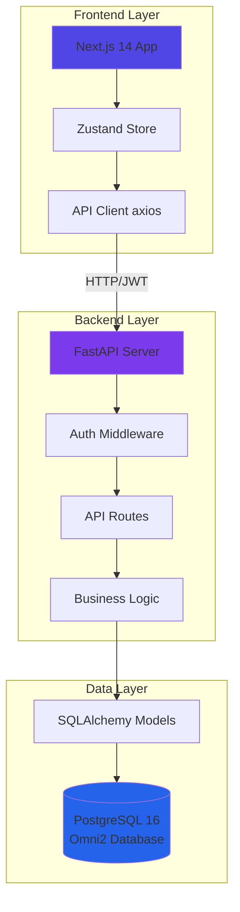
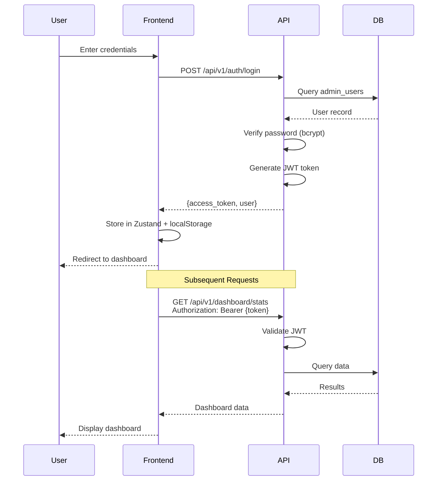
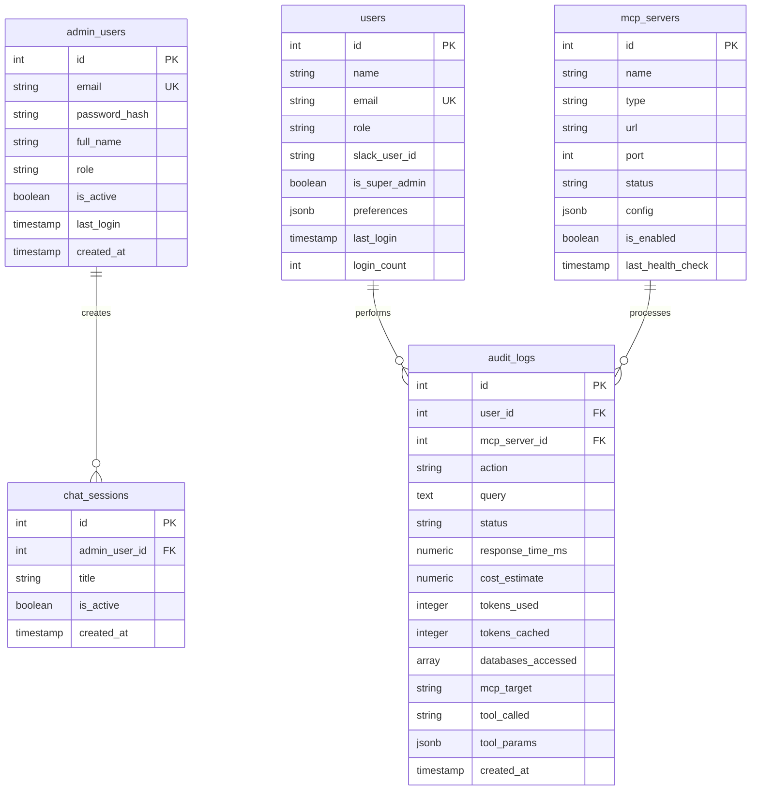
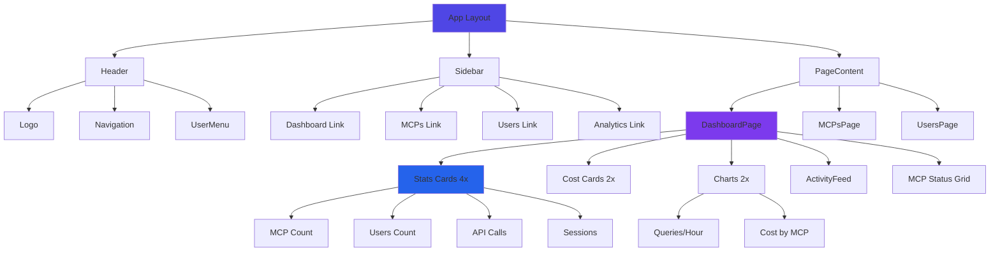

# Omni2 Admin Dashboard

Modern, responsive admin dashboard for Omni2 MCP Hub with real-time monitoring, analytics, and management capabilities.


---

## 🎯 Overview

Omni2 Admin Dashboard is a production-ready web application that provides a powerful, intuitive interface for managing and monitoring the Omni2 MCP Hub. Built with modern technologies, it offers real-time insights, comprehensive analytics, and streamlined management of MCP servers, users, and system configurations.

### ✨ Key Features

#### **Phase 3 Complete** ✅
- 🔐 **Secure Authentication**: JWT-based auth with bcrypt password hashing
- 📊 **Real-Time Dashboard**: Live statistics showing MCPs, users, API calls, and sessions
- 💰 **Cost Tracking**: Monitor costs by day/week with detailed breakdowns
- 📈 **Activity Feed**: Real-time view of recent queries and MCP usage
- 🏥 **Health Monitoring**: Track MCP server status and performance
- 📉 **Data Visualization**: Interactive charts for queries/hour and cost analysis
- 🎨 **Beautiful UI**: Dark/light themes, responsive design, smooth animations
- 📱 **Mobile Ready**: Works perfectly on all devices

#### **Phase 4: MCP Management** 🚧
- 🔌 **MCP CRUD Operations**: Create, read, update, delete MCP servers
- ⚙️ **Configuration Management**: Edit MCP settings and parameters
- 🔍 **Tools Discovery**: View available tools for each MCP
- 🔄 **Enable/Disable**: Control MCP server availability
- 🩺 **Health Checks**: Trigger manual health checks

#### **Coming Soon**
- 👥 **User Management**: Manage Omni2 users and roles
- 📊 **Advanced Analytics**: Custom date ranges, export capabilities
- 🔴 **WebSocket Updates**: Real-time push notifications
- 🔔 **Alerting**: Custom alerts for errors and thresholds

---

## 📚 Documentation

- [DESIGN.md](./DESIGN.md) - Visual design and UX specifications
- [ARCHITECTURE.md](./ARCHITECTURE.md) - Technical architecture and database schema
- [ROADMAP.md](./ROADMAP.md) - Development roadmap and progress tracking
- [ENHANCEMENTS.md](./ENHANCEMENTS.md) - Future enhancement proposals
- [backend/README.md](./backend/README.md) - Backend documentation
- [frontend/README.md](./frontend/README.md) - Frontend documentation (coming soon)

---

## 🚀 Quick Start

### Prerequisites

- **Docker & Docker Compose** (recommended)
- **Omni2 stack running** (provides PostgreSQL database)
- **Python 3.12+** (for backend development)
- **Node.js 18+** (for frontend development)

### Option 1: Docker Compose (Recommended)

**Important**: The admin dashboard uses the existing Omni2 PostgreSQL database. Start Omni2 stack first!

```bash
# 1. Start Omni2 stack (if not already running)
cd ../omni2
docker-compose up -d

# 2. Start admin dashboard
cd ../omni2-admin

# Copy environment files
cp backend/.env.example backend/.env
cp frontend/.env.local.example frontend/.env.local

# Edit .env files if needed (defaults should work)

# Start admin dashboard (connects to existing omni2-postgres)
docker-compose up --build

# In another terminal, seed admin user
docker-compose exec admin-api python scripts/seed_admin.py
```

Access:
- **Frontend**: http://localhost:3000
- **Backend API**: http://localhost:8500
- **API Docs**: http://localhost:8500/docs

### Option 2: Manual Setup

**Prerequisites**: Omni2 PostgreSQL must be running (port 5433 on host)

#### Backend

```bash
cd backend

# Create virtual environment
python -m venv venv
source venv/bin/activate  # Windows: venv\Scripts\activate

# Install dependencies
pip install -r requirements.txt

# Set up environment
cp .env.example .env
# DATABASE_URL is already set to connect to Omni2 PostgreSQL (localhost:5433)

# Run migrations
alembic upgrade head

# Seed admin user
python scripts/seed_admin.py

# Start server
uvicorn app.main:app --reload --port 8500
```

#### Frontend

```bash
cd frontend

# Install dependencies
pnpm install  # or npm install

# Set up environment
cp .env.local.example .env.local
# Edit .env.local

# Start dev server
pnpm dev  # or npm run dev
```

### Default Login

After seeding:
- **Email**: admin@omni2.com
- **Password**: admin123

⚠️ **Change this password immediately after first login!**

---

## 🏗️ Project Structure

```
omni2-admin/
├── DESIGN.md                # Visual design specification
├── ARCHITECTURE.md          # Technical architecture
├── ROADMAP.md              # Development roadmap
├── ENHANCEMENTS.md         # Enhancement proposals
├── docker-compose.yml      # Docker orchestration
│
├── backend/                # FastAPI backend
│   ├── app/
│   │   ├── api/           # API endpoints
│   │   ├── models/        # SQLAlchemy models
│   │   ├── schemas/       # Pydantic schemas
│   │   ├── services/      # Business logic
│   │   ├── utils/         # Utilities
│   │   └── middleware/    # Middleware
│   ├── alembic/           # Database migrations
│   ├── scripts/           # Utility scripts
│   ├── tests/             # Tests
│   └── requirements.txt
│
└── frontend/              # Next.js frontend (coming soon)
    ├── app/               # Next.js 14 App Router
    ├── components/        # React components
    ├── lib/               # Utilities
    ├── hooks/             # Custom hooks
    ├── stores/            # State management
    └── public/            # Static assets
```

---

## 🛠️ Tech Stack

### Backend
- **Framework**: FastAPI 0.115.0
- **Language**: Python 3.11+
- **Database**: PostgreSQL 16 + asyncpg
- **ORM**: SQLAlchemy 2.0.30 (async)
- **Migrations**: Alembic
- **Authentication**: PyJWT + bcrypt
- **Validation**: Pydantic 2.0

### Frontend
- **Framework**: Next.js 14 (App Router)
- **Language**: TypeScript 5.x
- **Styling**: Tailwind CSS 3.4
- **Components**: shadcn/ui (Radix UI)
- **Charts**: Recharts 2.x
- **State**: Zustand
- **HTTP Client**: axios

### Infrastructure
- **Containers**: Docker + Docker Compose
- **Database**: PostgreSQL 16 (shared with Omni2)
- **Ports**: Backend 8500, Frontend 3000
- **Network**: omni2_network (Docker bridge)

---

## � Architecture

### System Architecture



### Authentication Flow



### Dashboard Data Flow

```mermaid
graph LR
    subgraph "Dashboard Page"
        DashComp[Dashboard Component]
        Stats[Stats Cards]
        Activity[Activity Feed]
        Charts[Charts]
    end
    
    subgraph "API Endpoints"
        StatsAPI[/dashboard/stats]
        ActivityAPI[/dashboard/activity]
        ChartsAPI[/dashboard/charts]
    end
    
    subgraph "Database Queries"
        MCPs[(mcp_servers)]
        Users[(users)]
        Audit[(audit_logs)]
    end
    
    DashComp -->|Fetch| StatsAPI
    DashComp -->|Fetch| ActivityAPI
    DashComp -->|Fetch| ChartsAPI
    
    StatsAPI --> MCPs
    StatsAPI --> Users
    StatsAPI --> Audit
    
    ActivityAPI --> Audit
    ActivityAPI --> Users
    ActivityAPI --> MCPs
    
    ChartsAPI --> Audit
    
    StatsAPI -->|Stats| Stats
    ActivityAPI -->|Items| Activity
    ChartsAPI -->|Data| Charts
    
    style DashComp fill:#4f46e5
    style StatsAPI fill:#7c3aed
    style MCPs fill:#2563eb
```

### Database Schema



### Component Hierarchy



---

## 🎨 Features Deep Dive

### Dashboard (Phase 3 ✅)

**Statistics Cards:**
- **Total MCPs**: Count of all registered MCP servers
- **Total Users**: Active users in the system
- **API Calls (24h)**: Number of queries in last 24 hours
- **Active Sessions**: Current active chat sessions

**Cost Tracking:**
- **Cost Today**: Total estimated cost for current day
- **Cost This Week**: Cumulative weekly cost
- Real-time cost calculation from `audit_logs.cost_estimate`

**Activity Feed:**
- Last 10 recent queries
- User who made the query
- Query status (success/error/warning)
- Response time and cost
- MCP server that processed the query

**Charts:**
- **Queries by Hour**: 24-hour timeline of query volume
- **Cost by MCP**: Breakdown of costs per MCP server

**MCP Health Status:**
- Grid view of all MCP servers
- Health status indicators
- Last health check timestamp

### MCP Management (Phase 4 🚧)

**Features:**
- List all MCP servers with search/filter
- View detailed MCP configuration
- Create new MCP servers
- Edit existing MCP settings
- Enable/disable MCPs
- Trigger manual health checks
- View available tools per MCP
- Delete MCP servers (with confirmation)

**MCP Details:**
- Name, type, URL, port
- Configuration (JSON editor)
- Health check URL and interval
- Recent activity and statistics
- Available tools list

---

## 📊 Current Progress

**Overall**: Phase 3 Complete ✅

| Phase | Status | Completion |
|-------|--------|-----------|
| Phase 1: Foundation | ✅ Complete | 100% |
| Phase 2: Auth | ✅ Complete | 100% |
| Phase 3: Dashboard | ✅ Complete | 100% |
| Phase 4: MCP Management | 🚧 In Progress | 0% |
| Phase 5: User Management | ⏳ Planned | 0% |
| Phase 6: Advanced Analytics | ⏳ Planned | 0% |
| Phase 7: Real-Time Updates | ⏳ Planned | 0% |

### Phase 3 Achievements ✅
- ✅ JWT authentication with bcrypt
- ✅ Dashboard with live statistics
- ✅ Cost tracking (day/week)
- ✅ Activity feed with 10+ items
- ✅ MCP health monitoring
- ✅ Interactive charts (Recharts)
- ✅ Dark/light theme toggle
- ✅ Responsive design
- ✅ Auth persistence across refreshes

### Critical Fixes Applied
- ✅ Fixed User model: `username` → `name`, added 11 fields
- ✅ Fixed AuditLog model: added 20+ missing columns
- ✅ Re-enabled cost calculation with `cost_estimate` column
- ✅ Fixed auth store to prevent logout on refresh
- ✅ All APIs verified working (4 MCPs, 11 users, 12 calls)

---

## 🔐 Security

- **Authentication**: JWT tokens with 1-hour expiry
- **Authorization**: Role-based access control (admin role required)
- **Password Hashing**: bcrypt with 12 rounds
- **Rate Limiting**: Prevents brute force attacks (planned)
- **CORS**: Configured for http://localhost:3000
- **SQL Injection**: Protection via SQLAlchemy ORM
- **XSS**: Protection via React auto-escaping
- **Session Persistence**: localStorage with token validation

---

## 🧪 Testing

### API Testing
```bash
# Test login
curl -X POST http://localhost:8500/api/v1/auth/login \
  -H "Content-Type: application/json" \
  -d '{"email":"admin@omni2.com","password":"admin123"}'

# Test dashboard stats (with token)
curl -X GET http://localhost:8500/api/v1/dashboard/stats \
  -H "Authorization: Bearer YOUR_TOKEN_HERE"
```

### Development Testing
```bash
# Backend tests
cd backend
pytest
pytest --cov=app --cov-report=html

# Frontend tests
cd frontend
npm test
npm run test:coverage
```

### Database Verification
```bash
# Check actual database schema
docker exec omni2-postgres psql -U postgres -d omni -c "\d users"
docker exec omni2-postgres psql -U postgres -d omni -c "\d audit_logs"
docker exec omni2-postgres psql -U postgres -d omni -c "\d mcp_servers"

# Check admin users
docker exec omni2-postgres psql -U postgres -d omni -c "SELECT email, role FROM admin_users;"
```

---

## 📈 Performance

### Current Metrics
- **API Response Time**: 100-300ms (dashboard endpoints)
- **Dashboard Load**: ~500ms (cold), ~200ms (cached)
- **Database Queries**: 50-150ms per query
- **Frontend Render**: <100ms

### Optimization Applied
- Database indexes on `audit_logs` (created_at, user_id, mcp_server_id)
- SQLAlchemy query optimization with selective loading
- Frontend React.memo for expensive components
- Auto-refresh debouncing (30-second intervals)

---

## 🐛 Troubleshooting

### Common Issues

**1. Backend not starting**
```bash
# Check logs
docker logs omni2-admin-api --tail 50

# Verify database connection
docker exec omni2-postgres psql -U postgres -l
```

**2. Dashboard shows all zeros**
```bash
# Verify audit_logs has data
docker exec omni2-postgres psql -U postgres -d omni -c "SELECT COUNT(*) FROM audit_logs;"

# Check User model field names
# Should use 'name' not 'username'
```

**3. Logout on page refresh**
```bash
# Check browser console for errors
# Verify localStorage has 'auth-storage' key
# Check auth store fetchUser error handling
```

**4. "Failed to load dashboard data"**
```bash
# Check backend logs for SQLAlchemy errors
# Verify models match database schema
# Ensure cost_estimate column exists in audit_logs
```

### Debug Commands
```bash
# View all containers
docker ps -a

# Restart services
cd omni2-admin
docker-compose restart

# Check API health
curl http://localhost:8500/health

# View backend logs
docker logs -f omni2-admin-api

# View frontend logs
docker logs -f omni2-admin-web
```

---

## 🗺️ Roadmap

See [ROADMAP.md](./ROADMAP.md) for detailed phase breakdown.

**✅ Phase 1-3 Complete (January 6-7, 2026)**
- Foundation and project setup
- Authentication system
- Dashboard with live stats, cost tracking, activity feed

**🚧 Phase 4: MCP Management (In Progress)**
- MCP CRUD operations
- Health check triggers
- Tools discovery
- Configuration editor

**📅 Upcoming Phases**
- Phase 5: User Management
- Phase 6: Advanced Analytics
- Phase 7: Real-time WebSocket updates
- Phase 8: Production deployment

---

## 📝 Documentation

- **[DESIGN.md](./DESIGN.md)** - Visual design and UX specifications
- **[ARCHITECTURE.md](./ARCHITECTURE.md)** - Technical architecture details
- **[SPEC.md](./SPEC.md)** - Complete technical specification
- **[ROADMAP.md](./ROADMAP.md)** - Development roadmap and milestones
- **[ENHANCEMENTS.md](./ENHANCEMENTS.md)** - Future enhancement ideas
- **[backend/README.md](./backend/README.md)** - Backend API documentation

---

## 🤝 Contributing

### Development Workflow
1. Create feature branch: `git checkout -b feature/your-feature`
2. Make changes following code style
3. Test thoroughly
4. Update documentation
5. Commit: `git commit -m "feat: your feature"`
6. Push and create PR

### Code Style
- **Backend**: Black formatter, isort, type hints
- **Frontend**: ESLint, Prettier, TypeScript strict mode
- **Commits**: Conventional Commits (feat, fix, docs, etc.)

---

## 📞 Support & Links

- **Repository**: https://github.com/aviciot/omni2-admin-dashboard
- **Branch**: feature/business-logic-explanation
- **Issues**: Use GitHub Issues for bugs/features
- **Wiki**: See repository Wiki for guides

---

## 👥 Credits

**Project**: Omni2 Admin Dashboard  
**Organization**: Shift4 Corporation  
**Started**: January 6, 2026  
**Status**: Phase 3 Complete, Phase 4 In Progress

---

## 📄 License

Internal project - Shift4 Corporation. All rights reserved.
**Phase 6 (Week 4)**: Configuration Management  
**Phase 7 (Week 5)**: Analytics  
**Phase 8 (Week 5-6)**: Real-Time Updates  
**Phase 9 (Week 6)**: Polish & Enhancement  
**Phase 10 (Week 6)**: Documentation & Deployment  

See [ROADMAP.md](./ROADMAP.md) for full details.

---

**Last Updated**: January 6, 2026  
**Status**: 🏗️ Active Development  
**Version**: 0.1.0
